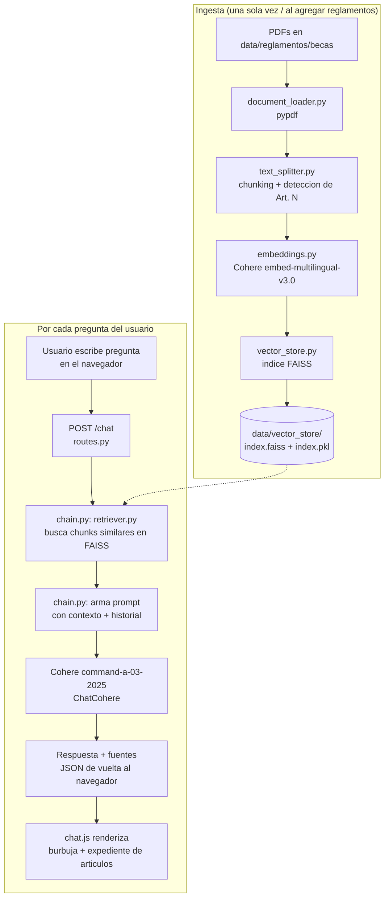

# ReglamentosRAG

Asistente conversacional que responde preguntas sobre los **reglamentos oficiales de la Universidad de Costa Rica (UCR)**, usando la técnica de **RAG (Retrieval-Augmented Generation)**: en vez de que el modelo "invente" respuestas desde su conocimiento general, busca primero en el texto real de los reglamentos y genera la respuesta basada únicamente en lo que encuentra ahí, citando el artículo y el reglamento de origen.

---

## 1. Descripción general

El proyecto expone un chat web donde el estudiantado puede preguntar cosas como *"¿cuántos créditos necesito para mantener la beca?"* y recibir una respuesta redactada en lenguaje natural, con las fuentes (artículo + reglamento) que la sustentan, en vez de tener que buscar manualmente en un PDF de 30 páginas.

El flujo es:

1. Los reglamentos (PDFs oficiales del Consejo Universitario) se procesan una única vez y se convierten en un índice vectorial searchable.
2. Cuando alguien hace una pregunta, el sistema busca los fragmentos de reglamento más relacionados semánticamente con esa pregunta.
3. Esos fragmentos se le entregan como contexto a un LLM (Cohere `command-a-03-2025`), que redacta la respuesta **solo** a partir de ese contexto.
4. Si no encuentra información relevante, el asistente lo dice explícitamente en vez de inventar una respuesta.

---

## 2. Arquitectura de la solución



### Capas del proyecto

| Capa | Carpeta / archivo | Responsabilidad |
|---|---|---|
| **Frontend** | `app/templates/index.html`, `app/static/` | Interfaz de chat (HTML/CSS/JS vanilla, sin frameworks) |
| **API** | `app/api/routes.py`, `app/api/schemas.py` | Expone `POST /chat` y `GET /health`, valida requests/responses con Pydantic |
| **RAG pipeline** | `app/rag/` | Carga, chunking, embeddings, índice vectorial, retriever y orquestación con el LLM |
| **Configuración** | `app/config/settings.py` | Variables centralizadas (`.env`), modelos, rutas, parámetros de chunking |
| **Scripts** | `scripts/ingest_documents.py` | Corre el pipeline de ingesta de punta a punta |

### Por qué esta arquitectura

- **Separación ingesta vs. consulta:** la ingesta (cargar PDFs, generar embeddings) es costosa y solo debe correr cuando se agregan/actualizan reglamentos, no en cada pregunta. Por eso vive en `scripts/`, separada de la API.
- **Metadata de citación en cada chunk:** al dividir el texto, se detecta automáticamente a qué "Artículo N" pertenece cada fragmento (vía regex), lo que permite mostrarle al usuario exactamente de dónde salió cada dato — clave para la confianza en un asistente que responde sobre normativa oficial.
- **El LLM no responde "libremente":** el prompt de sistema (`app/rag/prompt.py`) obliga al modelo a basarse únicamente en el contexto recuperado y a admitir explícitamente cuando no tiene la información, para minimizar alucinaciones sobre temas normativos donde una respuesta incorrecta tiene consecuencias reales para un estudiante.

---

## 3. Tecnologías y herramientas utilizadas

| Tecnología | Uso en el proyecto |
|---|---|
| **FastAPI** | Framework web para la API y para servir el frontend |
| **Uvicorn** | Servidor ASGI que ejecuta la aplicación |
| **LangChain** (`langchain`, `langchain-community`, `langchain-core`, `langchain-text-splitters`) | Orquestación del pipeline RAG: loaders, splitters, vector store, prompts |
| **LangChain-Cohere** (`langchain-cohere`) | Integración de LangChain con los modelos de Cohere |
| **Cohere** | Proveedor de LLM (`command-a-03-2025`) y de embeddings (`embed-multilingual-v3.0`, con buen soporte de español) |
| **FAISS** (`faiss-cpu`, de Meta AI) | Índice vectorial para búsqueda de similitud semántica |
| **pypdf** + **cryptography** | Extracción de texto de los PDFs de reglamentos (incluyendo PDFs con metadata encriptada) |
| **Pydantic / pydantic-settings** | Validación de datos de la API y configuración centralizada vía `.env` |
| **Jinja2** | Renderiza el `index.html` del frontend desde FastAPI |
| **HTML / CSS / JavaScript vanilla** | Interfaz de chat, sin frameworks de frontend, con diseño responsive para móvil |

---

## 4. Instrucciones para ejecutar el proyecto

### 4.1. Requisitos previos

- Python 3.11 o superior
- Una cuenta de [Cohere](https://cohere.com) (el plan gratuito/trial alcanza para desarrollo y pruebas)

### 4.2. Instalación

```bash
# 1. Clonar/entrar al proyecto
cd ReglamentosRAG

# 2. Crear y activar un entorno virtual
python -m venv .venv

# Windows
.venv\Scripts\activate
# macOS/Linux
source .venv/bin/activate

# 3. Instalar dependencias
pip install -r requirements.txt
```

### 4.3. Configuración

Creá un archivo `.env` en la raíz del proyecto:

```env
EMBEDDINGS_PROVIDER=cohere
COHERE_API_KEY=tu_api_key_de_cohere_aqui
```

> ⚠️ Con cuenta gratuita de Cohere, el trial key tiene límite de **1000 llamadas/mes**, **20 req/min en chat** y **5 req/min en embeddings** — tenelo en cuenta si la ingesta tarda o falla con muchos documentos.

### 4.4. Cargar los reglamentos (ingesta)

Colocá los PDFs de los reglamentos en `data/reglamentos/becas/`, y luego corré:

```bash
python scripts/ingest_documents.py
```

Esto genera `data/vector_store/index.faiss` e `index.pkl`. Solo hace falta repetir este paso cuando agregues o modifiques reglamentos.

### 4.5. Levantar el servidor

Parado en la **raíz del proyecto** (importante: no entrar a la carpeta `app/`):

```bash
uvicorn app.main:app --reload
```

Abrí **http://localhost:8000** en el navegador — ahí vas a ver el chat funcionando.

---

## 5. Ejemplos de preguntas que el agente puede responder

Basado en el *Reglamento de Adjudicación de Becas a la Población Estudiantil*:

- ¿Cuántos créditos necesito consolidar para mantener los beneficios de la beca?
- ¿Qué pasa si mi promedio ponderado baja de 7?
- ¿Cuáles son los beneficios de la categoría de Beca 5?
- ¿En qué casos se pierde la beca socioeconómica?
- ¿Puedo mantener la beca si no completo la carga académica completa?
- ¿Qué es la beca de excelencia académica y qué requisitos tiene?
- ¿Cada cuánto tengo que actualizar mi información socioeconómica ante la OBAS?

El asistente responde de forma similar sobre cualquier otro reglamento que se agregue a `data/reglamentos/` (Régimen Académico Estudiantil, Disciplinario, etc.).

---

## 6. Ejemplos de respuestas generadas por el agente

**Pregunta:** *¿Cuántos créditos se necesitan para mantener la beca?*

> Para mantener los beneficios otorgados, según el Artículo 18, se debe consolidar un total de 12 créditos por ciclo lectivo. En caso de consolidar una carga menor a 12 créditos, la OBAS aplicará al costo de los créditos consolidados el porcentaje de exoneración de matrícula que corresponda a la categoría de beca.
>
> **Fuentes:** `Art. 18` — *Reglamento de Adjudicación de Becas 2015*

---

**Pregunta:** *¿Qué pasa si mi promedio baja de 7 dos años seguidos?*

> Según el Artículo 20, cuando no se alcanza un promedio ponderado anual de al menos 7, se aplica una disminución del porcentaje de exoneración de matrícula: 20% el primer año y 40% el segundo año, según la categoría de beca asignada.
>
> **Fuentes:** `Art. 20` — *Reglamento de Adjudicación de Becas 2015*

---

**Pregunta (fuera del alcance del reglamento):** *¿Quién es el rector de la UCR?*

> No encontré esa información en los reglamentos consultados. Para obtener datos sobre la autoridad actual de la Universidad de Costa Rica, te sugiero consultar el sitio web oficial de la UCR o comunicarte directamente con la Oficina de la Rectoría.
>
> **Fuentes:** *(ninguna — el asistente no cita artículos cuando no tiene información real que respalde la respuesta)*

---

## 7. Notas y limitaciones conocidas

- El asistente **no da asesoría legal**; para casos particulares siempre remite a la oficina correspondiente (ej. OBAS para temas de becas).
- Las respuestas dependen de la calidad y vigencia de los PDFs cargados en `data/reglamentos/becas/` — si un reglamento se reforma, hay que reemplazar el PDF y volver a correr `ingest_documents.py`.
- Con cuenta gratuita de Cohere, la velocidad de ingesta y de respuesta está limitada por los rate limits del plan trial (ver sección 4.3).

> [!IMPORTANT]
> Puede acceder al despliegue en oracle cloud a traves de la IP Publica = [159.54.156.109](http://159.54.156.109).

## 9. Evidencia del despliegue 


